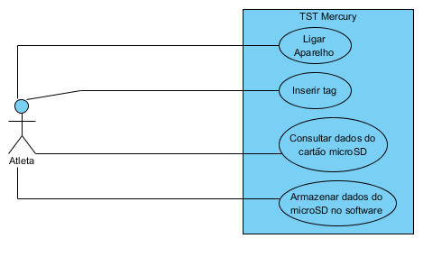
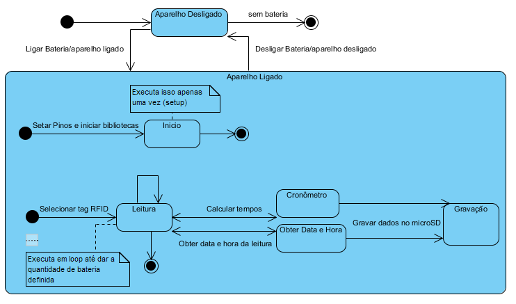
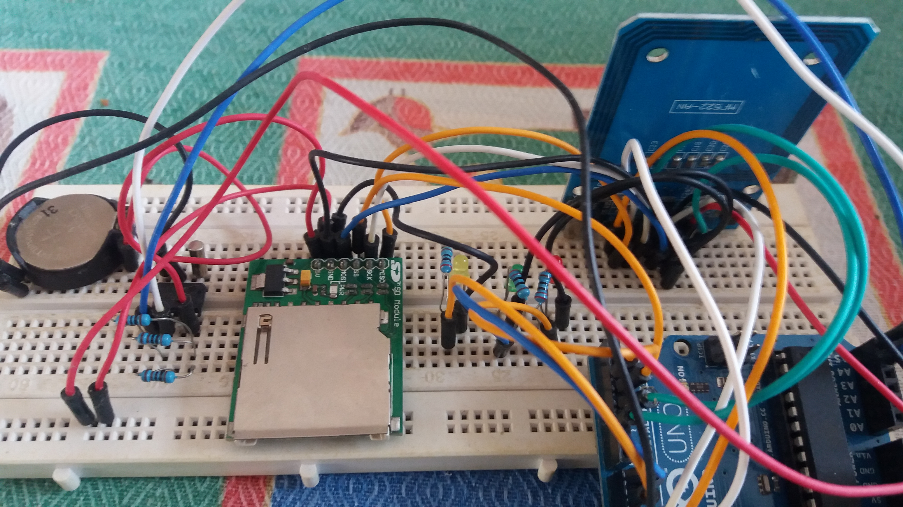
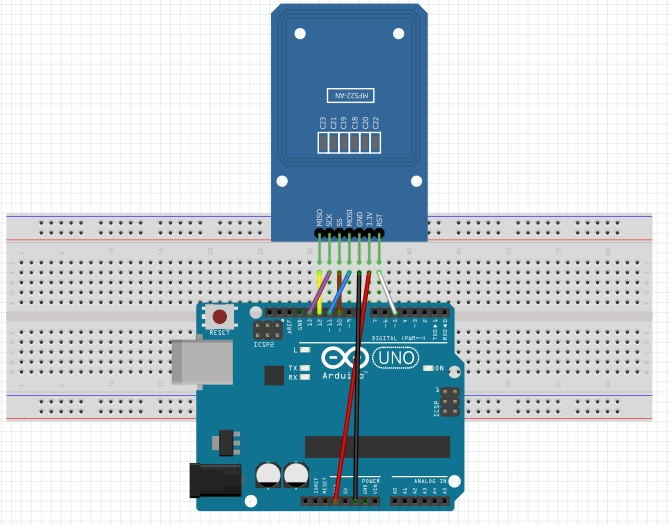
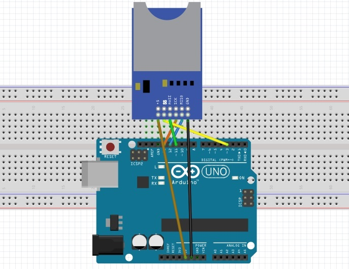
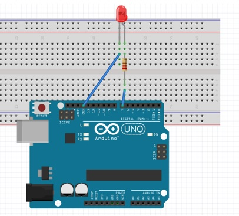
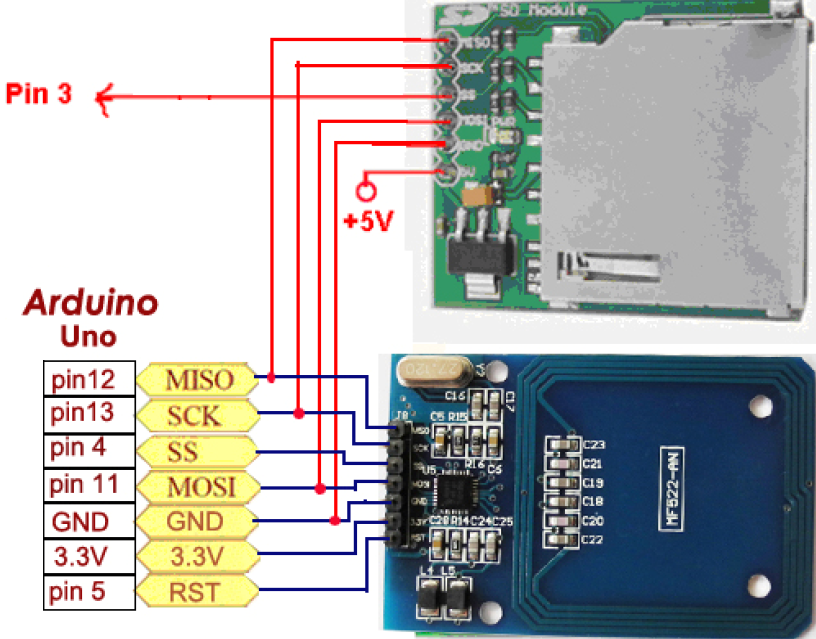
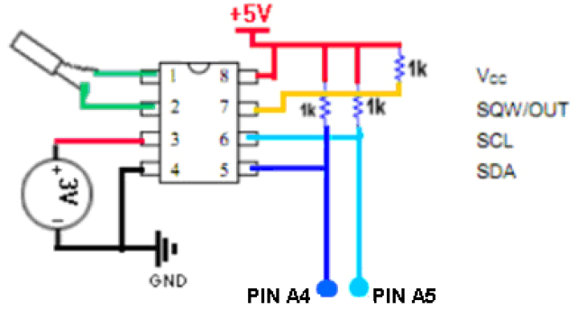

# TCC_Arduino_TST_Mercury

Parte do hardware do projeto desenvolvido e entregue no TCC "TST MERCURY: SISTEMA PARA A MODALIDADE MOTOCROSS UTILIZANDO A PLATAFORMA ARDUINO PARA CRONOMETRAGEM" para formação no curso ADS.

Projeto de prototipagem com arduino, módulo de RFID e SD que realiza a cronometragem de um ponto a outro. 

A ideia do hardware do projeto segue conforme os diagramas abaixo:

Diagrama de caso de uso:

Diagrama de máquina:

Imagem do projeto todo:

Segue a montagem dos componentes utilizados:

Circuito Arduino e RFID:

Circuito Arduino e módulo SD:

Circuito de Arduino e led:

Circuito entre Arduino Uno, RFID e módulo SD:

